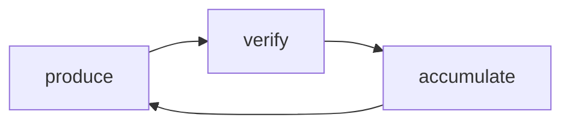

  

  

---

## The Problem

AI coding assistants are effective producers. But they're not reliable self-verifiers.

A shared session accumulates local assumptions, abandoned approaches, and retry artifacts — each reinforcing "the previous call was right." When review reuses that context, it inherits the author's framing instead of independently re-deriving correctness.

**You can verify every diff and still miss the bigger picture.**

## Philosophy

Every meaningful AI coding task is a closed loop:

- **Loop-first** — No step is done until independently verified
- **Wire-composable** — Loops connect through machine contracts, not chat history
- **Surface-shared** — Knowledge persists across sessions, models, and hosts

CrossReview implements **verify**. Sopify implements **wire** and **surface**.

## Two Products, One Loop

| Loop Role | What It Does | Project |
|-----------|-------------|---------|
| **verify** | Context-isolated cross-review — same model, clean session, independent second pass | [CrossReview](https://github.com/evidentloop/cross-review) |
| **wire + surface** | Full workflow orchestration — checkpoints, blueprints, traceable decision chains | [Sopify](https://github.com/evidentloop/Sopify) |

**[CrossReview](https://github.com/evidentloop/cross-review)** — Verification primitive for AI coding. Same model, clean session, independent second pass on your output. Atomic and composable — runs standalone or as a verification step inside broader workflows.

**[Sopify](https://github.com/evidentloop/Sopify)** — AI coding workflow orchestration layer. Manages state, plans, and decisions across the full lifecycle — checkpoints when facts are missing, resumes from state, not from scratch. CrossReview is designed to slot in as its verification step.

---

CrossReview is the **verify** — atomic, isolated, independent.  
Sopify is the **wire + surface** — connecting loops, accumulating knowledge.  
Together, they close the loop.

  

