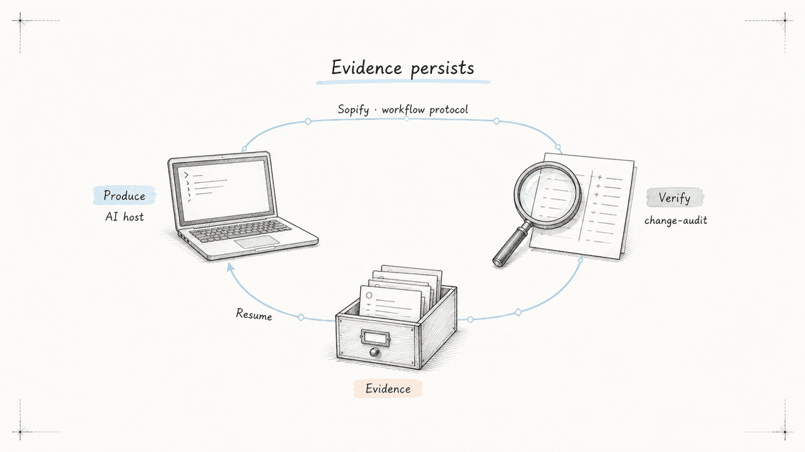

# EvidentLoop

**Infrastructure for resumable, auditable AI coding.**

AI coding moves fast. EvidentLoop keeps the work resumable and the evidence inspectable.

| Project | What It Does |
|---------|--------------|
| **[Sopify](https://github.com/evidentloop/sopify)** | Resumable workflow protocol for AI coding. Keeps requirements, plans, checkpoints, decisions, and verification evidence with the repo across sessions and hosts. |
| **[Evidentloop](https://github.com/evidentloop/evidentloop)** | Traceable review for AI-generated changes. Anchors findings to the real diff and publishes validated `audit.json` and self-contained `audit.html` reports. |

## The Evident Loop

  

AI hosts produce. **evidentloop** turns review into traceable evidence. **Sopify** preserves workflow context so work can resume across sessions and hosts.

Together, they cover two complementary problems: continuity while work is happening, and evidence after a change.
