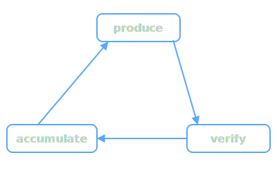

## What We Build

AI coding assistants produce code fast — but they don't verify their own work, and they forget everything between sessions.

EvidentLoop builds two tools that fix this:

| Tool | What It Does |
|------|-------------|
| **[Sopify](https://github.com/evidentloop/sopify)** | Workflow layer for AI coding. Stops when facts are missing, resumes from checkpoints, traces every decision. Install into Codex, Claude, or Copilot — no new editor. |
| **[CrossReview](https://github.com/evidentloop/cross-review)** | Independent code review. Same model, clean session, no shared context — catches what the author's session can't see. |

## How They Fit Together

  

Every AI coding task is a loop: **produce → verify → accumulate → produce**.

- **Sopify** orchestrates the loop — plans, checkpoints, and knowledge persist across sessions and hosts
- **CrossReview** closes the loop — an isolated second pass that doesn't inherit the author's assumptions

Sopify handles the workflow. CrossReview handles the blind spots. Together, no step ships unverified and no context is lost.
